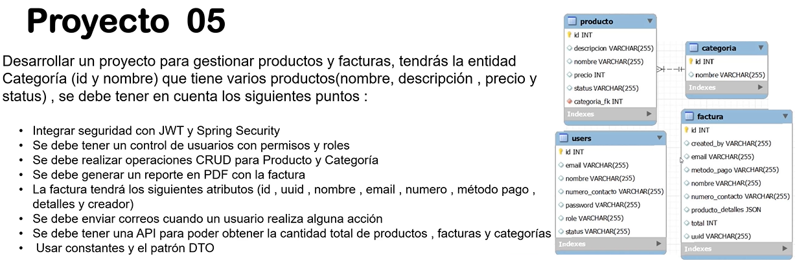
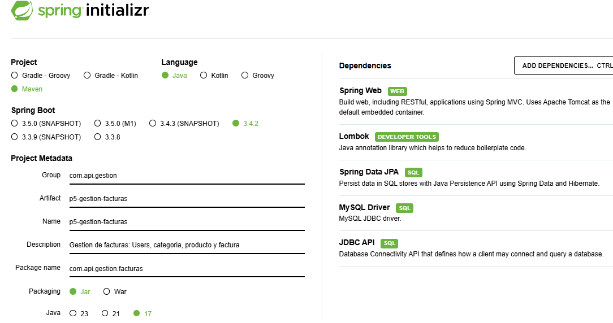
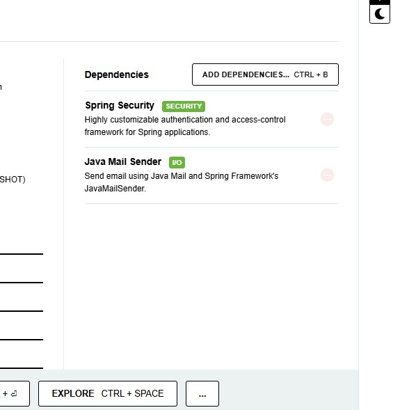
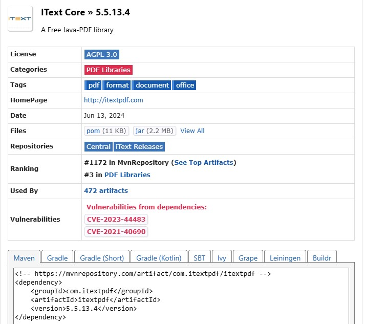
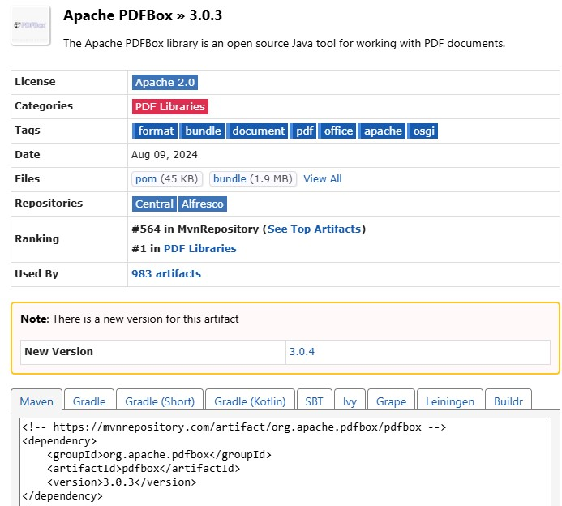

# Proyecto 05: Gestión de Productos y Facturas

Este proyecto tiene como objetivo desarrollar una API para simular gestion de Facturas, creacion usuarios, productos, categorias y Facturas.

<div align="center">
   <h1>Challenge | Java | Back End - SpringBoot | API REST - Gestión Facturas</h1>
</div>

<p align="center">
  <br>
  
  
</p>

👨🏻‍💻 <strong>Gerson Escobedo Pérez </strong></br>
<a href="https://www.linkedin.com/in/gerson-escobedo/" target="_blank">
</a>


## Descripción
Este proyecto tiene como objetivo desarrollar un sistema para la gestión de productos y facturas. La entidad principal es **Categoría**, que contiene múltiples productos con los siguientes atributos:

- **Categoría:** `id`, `nombre`
- **Producto:** `nombre`, `descripción`, `precio`, `status`

## Requerimientos del Proyecto

- **Seguridad:** Integración de seguridad utilizando **JWT** y **Spring Security**.
- **Control de usuarios:** Implementación de permisos y roles para la gestión de usuarios.
- **Operaciones CRUD:** Funcionalidad completa para Productos y Categorías.
- **Generación de reportes:** Creación de reportes en **PDF** para las facturas.
- **Atributos de la factura:** Cada factura debe incluir:
    - `id`, `uuid`, `nombre`, `email`, `número`, `método de pago`, `detalles`, y `creador`
- **Notificaciones por correo:** Envío de correos electrónicos al realizar acciones en el sistema.
- **API estadística:** Endpoint para obtener la cantidad total de:
    - Productos, facturas y categorías.
- **Buenas prácticas:** Uso de constantes y el patrón **DTO**.

### Imagen de Requerimientos


### Dependencias del Proyecto


#### Dependecias de Security



#### Dependencia para Reportes PDF



- Otras dependencias de utilidad fueron agregas en el POM.xml 

## 🖥️ Tecnologías utilizadas
- ☕ Java 17
- JPA Hibernate
- [Intellij](https://www.jetbrains.com/idea/)
- [MySql](https://www.mysql.com/)
- [Java](https://www.java.com/en/)

## ⚠️ Importante! ⚠️
☕ Usar Java versión 8 o superior para compatibilidad. </br></br>
📝 Recomiendo usar el editor de Intellij</br></br>

## Instalación

1. Clonar el repositorio:
   ```bash
   git clone https://github.com/Gerson121295/SWR-P04-BancaDigital.git
   ```
2. Navegar al directorio del proyecto:
   ```bash
   cd <SWR-P03-Encuestas>
   ```
3. Construir el proyecto con Maven:
   ```bash
   mvn clean install
   ```
4. Ejecutar la aplicación:
   ```bash
   mvn spring-boot:run
   ```
## Endpoints
### Usuarios
#### Registro de Usuario
**POST** `http://localhost:8081/api/v1/user/signup`
```json
{
  "nombre": "Gema",
  "numeroDeContacto": "45215875",
  "email": "Gema@gmail.com",
  "password": "123456"
}
```
Nota: Los campos status y role se agregan por defecto en UserServiceImpl.

#### Inicio de Sesión
**POST** `http://localhost:8081/api/v1/user/login`
```json
{
  "email": "jas@gmail.com",
  "password": "123456"
}
```
Nota: Para cambiar de role user a admin y status, actualiza en la base de datos:
```sql
UPDATE users SET status="true" WHERE nombre="jas";
```

#### Obtener lista de Usuarios
**GET** `http://localhost:8081/api/v1/user/get`
- **Requiere token**
- El usuario debe tener Role Admin y status `true`

#### Actualizar el estado del Usuario
**PUT** `http://localhost:8081/api/v1/user/update`
```json
{
  "id": "6",
  "status": "true"
}
```
- **Requiere token**
- El usuario debe tener Role Admin

#### Validar Token
**GET** `http://localhost:8081/api/v1/user/checkToken`
- **Requiere token**

#### Cambiar Contraseña del Usuario Logueado
**POST** `http://localhost:8081/api/v1/user/changePassword`
```json
{
  "oldPassword": "123456",
  "newPassword": "12345"
}
```
- **Requiere token**

#### Recuperar Contraseña - No Logueado
**POST** `http://localhost:8081/api/v1/user/forgotPassword`
```json
{
  "email": "gerson2millones@gmail.com"
}
```
- **No requiere token**

### Categoría

#### Agregar o Actualizar Categoría
**POST** `http://localhost:8081/api/v1/categoria/add`
```json
// Crear
{
  "nombre": "Bebidas"
}

// Actualizar
{
  "id": "1",
  "nombre": "Muebles"
}
```
- **Requiere token**

#### Mostrar Categorías
**GET** `http://localhost:8081/api/v1/categoria/get`
- Parámetro opcional: `valueFilter=true`

#### Actualizar Categoría
**POST** `http://localhost:8081/api/v1/categoria/update`
```json
{
  "id": "1",
  "nombre": "Vegetales"
}
```
- **Requiere token**

### Producto

#### Agregar Producto
**POST** `http://localhost:8081/api/v1/producto/add`
```json
{
  "categoriaId": "2",
  "nombre": "Laptop HP",
  "descripcion": "pavillon 16pg",
  "precio": "1500"
}
```
- **Requiere token**

#### Lista de Productos
**GET** `http://localhost:8081/api/v1/producto/get`
- **Requiere token**

#### Actualizar Producto
**POST** `http://localhost:8081/api/v1/producto/update`
```json
{
  "id": 1,
  "categoriaId": "2",
  "nombre": "Laptop Lenovo",
  "descripcion": "16 pulgadas",
  "precio": "15000"
}
```
- **Requiere token**

#### Eliminar Producto
**POST** `http://localhost:8081/api/v1/producto/delete/2`
- **Requiere token**

#### Actualizar Estado del Producto
**POST** `http://localhost:8081/api/v1/producto/updateStatus`
- **Requiere token**

#### Obtener Productos por Categoría
**GET** `http://localhost:8081/api/v1/producto/getByCategoria/1`
- **No requiere token**

#### Obtener Producto por ID
**GET** `http://localhost:8081/api/v1/producto/getById/1`
- **No requiere token**

### Factura

#### Generar Reporte PDF de Factura
**POST** `http://localhost:8081/api/v1/factura/generarReporte`
```json
{
  "fileName": "reporte-factura",
  "numeroContacto": "981091672",
  "email": "test@gmail.com",
  "nombre": "Test",
  "metodoPago": "Cash",
  "productoDetalles": "[{\"id\":18,\"nombre\":\"Nombre 01\",\"categoria\":\"Coffee\",\"cantidad\":\"1\",\"precio\":120,\"total\":120},{\"id\":19,\"nombre\":\"Nombre 02\",\"categoria\":\"Coffee\",\"cantidad\":\"3\",\"precio\":220,\"total\":120},{\"id\":20,\"nombre\":\"Nombre 03\",\"categoria\":\"Coffee\",\"cantidad\":\"3\",\"precio\":120,\"total\":120},{\"id\":21,\"nombre\":\"Nombre 04\",\"categoria\":\"Coffee\",\"cantidad\":\"1\",\"precio\":120,\"total\":120}]",
  "montoTotal": "279"
}
```
- **Requiere token**

#### Obtener Facturas
**GET** `http://localhost:8081/api/v1/factura/getFacturas`
- **Requiere token**

#### Generar PDF
**POST** `http://localhost:8081/api/v1/factura/getPdf`
```json
{
  "fileName": "reporte-factura",
  "uuid": "FACTURA-1738963435374",
  "numeroContacto": "981091672",
  "email": "test@gmail.com",
  "nombre": "Test",
  "metodoPago": "Cash",
  "productoDetalles": "[{\"id\":18,\"nombre\":\"Nombre 01\",\"categoria\":\"Coffee\",\"cantidad\":\"1\",\"precio\":120,\"total\":120},{\"id\":19,\"nombre\":\"Nombre 02\",\"categoria\":\"Coffee\",\"cantidad\":\"3\",\"precio\":220,\"total\":120},{\"id\":20,\"nombre\":\"Nombre 03\",\"categoria\":\"Coffee\",\"cantidad\":\"3\",\"precio\":120,\"total\":120},{\"id\":21,\"nombre\":\"Nombre 04\",\"categoria\":\"Coffee\",\"cantidad\":\"1\",\"precio\":120,\"total\":120}]",
  "montoTotal": "279"
}
```
- **Requiere token**
- **requerido que el json tenga el uuid**

#### Eliminar Factura
**POST** `http://localhost:8081/api/v1/factura/delete/2`
- **Requiere token**

### Dashboard

#### Obtener Detalles del Dashboard
**GET** `http://localhost:8081/api/v1/dashboard/detalles`
- **Requiere token**
- Retorna:
```json
{
  "facturas": 1,
  "categorias": 3,
  "productos": 7
}
```

## Notas
- Asegúrate de que el servidor esté activo en `http://localhost:8081` para realizar las peticiones.
- Utiliza herramientas como Postman o cURL para probar los endpoints.
- Los IDs utilizados en los ejemplos son ficticios; reemplázalos por los correspondientes a tu base de datos.

# 💙 Personas Contribuyentes
## Autores
[<br><sub>Gerson Escobedo</sub>](https://github.com/gerson121295)

# Licencia


License: [MIT](License.txt)
